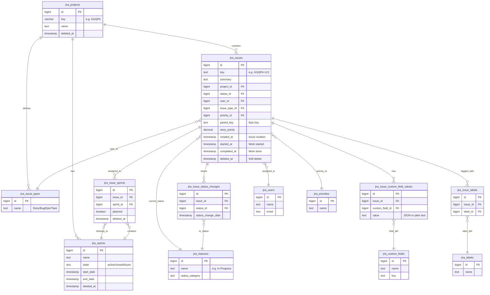

# Jira Data Extraction Handbook

> AI-optimized reference for extracting and analyzing Jira issue metrics from PostgreSQL.

---

## 1. Entity Relationship Diagram



---

## 2. Core Business Concepts

### 2.1 Time Metrics

| Metric         | Definition                                     | Formula                                                |
| -------------- | ---------------------------------------------- | ------------------------------------------------------ |
| **Lead Time**  | Total time from issue creation to completion   | `completed_at - created_at` (workdays only)            |
| **Cycle Time** | Active work time from start to completion      | `completed_at - started_at` (workdays only)            |
| **Dev Done**   | Time until development complete (Ready for QA) | First entry into `Ready for QA`, `In QA`, or `QA Done` |
| **QA Done**    | Time until QA complete                         | First entry into `QA Done` status                      |

### 2.2 Status Flow Categories

```
to_do → in_progress → blocked_pending → code_review → ready_for_qa → in_qa → qa_done → business_approved → deployed_to_prod → done
```

| Category            | Status Names      |
| ------------------- | ----------------- |
| `to_do`             | To Do             |
| `in_progress`       | In Progress       |
| `blocked_pending`   | Waiting           |
| `code_review`       | Code review       |
| `ready_for_qa`      | Ready for QA      |
| `in_qa`             | In QA             |
| `qa_done`           | QA Done           |
| `business_approved` | Business Approved |
| `deployed_to_prod`  | Deployed to PROD  |
| `done`              | Done              |

### 2.3 Key Timestamps

| Field          | Meaning                                         |
| -------------- | ----------------------------------------------- |
| `created_at`   | When the issue was created in Jira              |
| `started_at`   | When work began (first transition out of To Do) |
| `completed_at` | When issue reached Done status                  |

---

## 3. Important Custom Fields

| ID  | Name                    | Key               | Value Format                   |
| --- | ----------------------- | ----------------- | ------------------------------ |
| 107 | AI-Assisted development | customfield_10119 | `"Yes"` / `"No"`               |
| 109 | Tester                  | customfield_10110 | JSON: `{"displayName": "..."}` |
| 86  | Change type             | customfield_10118 | Plain text                     |

---

## 4. Workday Calculation

Exclude weekends (Saturday=6, Sunday=0) from all time calculations:

```sql
-- Generate workday series
SELECT d::date AS workday
FROM generate_series(
  '2024-01-01'::date,
  CURRENT_DATE,
  '1 day'::interval
) AS d
WHERE EXTRACT(DOW FROM d) NOT IN (0, 6)
```

---

## 5. Example Query: Issue Analysis with Time Metrics

```sql
WITH base_issues AS (
  -- Filter issues by project and type
  SELECT
    ji.id,
    ji.key AS issue_key,
    ji.summary,
    ji.story_points,
    ji.source_url,
    ji.parent_key,
    ji.status_id,
    ji.user_id,
    ji.issue_type_id,
    ji.priority_id,
    ji.created_at,
    ji.started_at,
    ji.completed_at,
    jit.name AS issue_type_name,
    COALESCE(aiad.value = 'Yes', false) AS is_aiad
  FROM jira_issues ji
  JOIN jira_projects jp ON ji.project_id = jp.id
  JOIN jira_issue_types jit ON ji.issue_type_id = jit.id
  LEFT JOIN jira_issue_custom_field_values aiad
    ON ji.id = aiad.issue_id AND aiad.custom_field_id = 107
  WHERE jp.key = $project_key
    AND jit.name IN ('Story', 'Bug')
    AND ji.deleted_at IS NULL
),

workdays AS (
  -- Generate workday sequence excluding weekends
  SELECT d::date AS workday
  FROM generate_series(
    (SELECT MIN(created_at)::date FROM base_issues),
    CURRENT_DATE + INTERVAL '1 year',
    '1 day'::interval
  ) AS d
  WHERE EXTRACT(DOW FROM d) NOT IN (0, 6)
),

latest_sprint AS (
  -- Get most recent sprint for each issue
  SELECT DISTINCT ON (bi.id)
    bi.id AS issue_id,
    js.name AS sprint_name
  FROM base_issues bi
  JOIN jira_issue_sprints jis ON bi.id = jis.issue_id AND jis.deleted_at IS NULL
  JOIN jira_sprints js ON jis.sprint_id = js.id
  ORDER BY bi.id, js.start_date DESC
),

dev_done_dates AS (
  -- First transition to dev-complete status
  SELECT
    jisc.issue_id,
    MIN(jisc.status_change_date) AS dev_done_date
  FROM jira_issue_status_changes jisc
  JOIN jira_statuses js ON jisc.status_id = js.id
  WHERE js.name IN ('Ready for QA', 'In QA', 'QA Done')
    AND jisc.issue_id IN (SELECT id FROM base_issues)
  GROUP BY jisc.issue_id
),

qa_done_dates AS (
  -- First transition to QA Done
  SELECT
    jisc.issue_id,
    MIN(jisc.status_change_date) AS qa_done_date
  FROM jira_issue_status_changes jisc
  JOIN jira_statuses js ON jisc.status_id = js.id
  WHERE js.name = 'QA Done'
    AND jisc.issue_id IN (SELECT id FROM base_issues)
  GROUP BY jisc.issue_id
),

time_metrics AS (
  -- Calculate all time metrics using workdays
  SELECT
    bi.id AS issue_id,
    -- Cycle Time (Done): started_at → completed_at
    CASE WHEN bi.completed_at IS NOT NULL AND bi.started_at IS NOT NULL THEN
      (SELECT COUNT(*) FROM workdays w
       WHERE w.workday BETWEEN bi.started_at::date AND bi.completed_at::date)
    ELSE 0 END AS cycle_time_done,

    -- Cycle Time (Dev Done): started_at → dev_done_date
    CASE WHEN ddd.dev_done_date IS NOT NULL AND bi.started_at IS NOT NULL THEN
      (SELECT COUNT(*) FROM workdays w
       WHERE w.workday BETWEEN bi.started_at::date AND ddd.dev_done_date::date)
    ELSE 0 END AS cycle_time_dev_done,

    -- Lead Time (Done): created_at → completed_at
    CASE WHEN bi.completed_at IS NOT NULL THEN
      (SELECT COUNT(*) FROM workdays w
       WHERE w.workday BETWEEN bi.created_at::date AND bi.completed_at::date)
    ELSE 0 END AS lead_time_done,

    -- Lead Time (Dev Done): created_at → dev_done_date
    CASE WHEN ddd.dev_done_date IS NOT NULL THEN
      (SELECT COUNT(*) FROM workdays w
       WHERE w.workday BETWEEN bi.created_at::date AND ddd.dev_done_date::date)
    ELSE 0 END AS lead_time_dev_done
  FROM base_issues bi
  LEFT JOIN dev_done_dates ddd ON bi.id = ddd.issue_id
),

custom_field_values AS (
  -- Aggregate custom field values
  SELECT
    bi.id AS issue_id,
    MAX(CASE WHEN cf.name = 'Tester'
        THEN cf_val.value::json->>'displayName' END) AS tester,
    MAX(CASE WHEN cf.name = 'Change type'
        THEN cf_val.value END) AS change_type
  FROM base_issues bi
  LEFT JOIN jira_issue_custom_field_values cf_val ON bi.id = cf_val.issue_id
  LEFT JOIN jira_custom_fields cf ON cf_val.custom_field_id = cf.id
  WHERE cf.name IN ('Tester', 'Change type')
  GROUP BY bi.id
)

SELECT
  bi.issue_key AS "Issue Key",
  bi.summary AS "Summary",
  bi.issue_type_name AS "Type",
  js.name AS "Status",
  ju.name AS "Assignee",
  cfv.tester AS "Tester",
  bi.story_points AS "Story Points",
  tm.cycle_time_dev_done AS "Cycle Time (Dev Done)",
  tm.cycle_time_done AS "Cycle Time (Done)",
  tm.lead_time_dev_done AS "Lead Time (Dev Done)",
  tm.lead_time_done AS "Lead Time (Done)",
  ls.sprint_name AS "Sprint",
  epic.summary AS "Epic",
  CASE WHEN bi.is_aiad THEN 'Yes' ELSE 'No' END AS "AI Assisted",
  cfv.change_type AS "Change Type",
  jp.name AS "Priority",
  bi.source_url AS "Link"
FROM base_issues bi
LEFT JOIN jira_statuses js ON bi.status_id = js.id
LEFT JOIN jira_users ju ON bi.user_id = ju.id
LEFT JOIN jira_priorities jp ON bi.priority_id = jp.id
LEFT JOIN jira_issues epic ON bi.parent_key = epic.key
LEFT JOIN latest_sprint ls ON bi.id = ls.issue_id
LEFT JOIN time_metrics tm ON bi.id = tm.issue_id
LEFT JOIN custom_field_values cfv ON bi.id = cfv.issue_id
ORDER BY
  CASE WHEN js.name = 'Done' THEN 0 ELSE 1 END,
  js.name,
  bi.id;
```

### Query Parameters

| Parameter      | Description      | Example   |
| -------------- | ---------------- | --------- |
| `$project_key` | Jira project key | `'GGQPA'` |

---

## 6. Common Query Patterns

### 6.1 Filter by Project

```sql
JOIN jira_projects jp ON ji.project_id = jp.id
WHERE jp.key = 'PROJECT_KEY'
```

### 6.2 Filter by Sprint

```sql
JOIN jira_issue_sprints jis ON ji.id = jis.issue_id AND jis.deleted_at IS NULL
JOIN jira_sprints js ON jis.sprint_id = js.id
WHERE js.name = 'Sprint Name'
```

### 6.3 Filter by Issue Type

```sql
JOIN jira_issue_types jit ON ji.issue_type_id = jit.id
WHERE jit.name IN ('Story', 'Bug')
```

### 6.4 Get Custom Field Value

```sql
-- Plain text value
SELECT value FROM jira_issue_custom_field_values
WHERE issue_id = $issue_id AND custom_field_id = $field_id;

-- JSON value (extract displayName)
SELECT value::json->>'displayName' FROM jira_issue_custom_field_values
WHERE issue_id = $issue_id AND custom_field_id = $field_id;
```

### 6.5 Get Latest Sprint for Issue

```sql
SELECT DISTINCT ON (issue_id)
  jis.issue_id, js.name AS sprint_name
FROM jira_issue_sprints jis
JOIN jira_sprints js ON jis.sprint_id = js.id
WHERE jis.deleted_at IS NULL
ORDER BY jis.issue_id, js.start_date DESC;
```

### 6.6 Track Status Duration

```sql
-- Calculate days in each status
WITH status_changes AS (
  SELECT
    issue_id,
    status_id,
    status_change_date AS start_date,
    LEAD(status_change_date) OVER (PARTITION BY issue_id ORDER BY status_change_date) AS end_date
  FROM jira_issue_status_changes
)
SELECT
  issue_id,
  js.name AS status,
  EXTRACT(EPOCH FROM (COALESCE(end_date, NOW()) - start_date)) / 86400 AS days
FROM status_changes sc
JOIN jira_statuses js ON sc.status_id = js.id;
```

---

## 7. Warnings & Best Practices

### ⚠️ Critical Filters

| Filter                   | Reason                             |
| ------------------------ | ---------------------------------- |
| `ji.deleted_at IS NULL`  | Exclude soft-deleted issues        |
| `jis.deleted_at IS NULL` | Exclude removed sprint assignments |
| `js.deleted_at IS NULL`  | Exclude deleted sprints            |

### ⚠️ Data Quality Issues

1. **Missing timestamps**: `started_at` or `completed_at` may be NULL if workflow wasn't followed
2. **Multiple sprints**: Issues can belong to multiple sprints; use `DISTINCT ON` with `ORDER BY start_date DESC` for latest
3. **Custom field JSON**: Some values are JSON objects, use `value::json->>'key'` to extract

### ⚠️ Performance Tips

1. **Always filter by project first** - reduces dataset significantly
2. **Use CTEs** - improves readability and allows query optimizer to work efficiently
3. **Avoid N+1 in workday calculations** - pre-generate workday series in a CTE
4. **Index awareness** - `project_id`, `issue_id`, `status_id` are indexed

### ⚠️ Common Mistakes

| Mistake                          | Correction                                 |
| -------------------------------- | ------------------------------------------ |
| Using calendar days              | Use workday calculation excluding weekends |
| Ignoring `deleted_at`            | Always check for soft deletes              |
| Hardcoding custom field IDs      | Query `jira_custom_fields` by name first   |
| Using wrong AI-Assisted field ID | Correct ID is **107**, not 87              |

---

## 8. Quick Reference: Status IDs

| ID  | Status Name       |
| --- | ----------------- |
| 1   | To Do             |
| 3   | In Progress       |
| 10  | Waiting           |
| 15  | Code review       |
| 5   | Ready for QA      |
| 6   | In QA             |
| 14  | QA Done           |
| 9   | Business Approved |
| 11  | Deployed to PROD  |
| 4   | Done              |

---

## 9. Quick Reference: Issue Types

| Type     | Use Case                     |
| -------- | ---------------------------- |
| Story    | Feature development work     |
| Bug      | Defect fixes                 |
| Epic     | Parent container for stories |
| Task     | Non-development work         |
| Sub-task | Child of Story/Bug/Task      |
